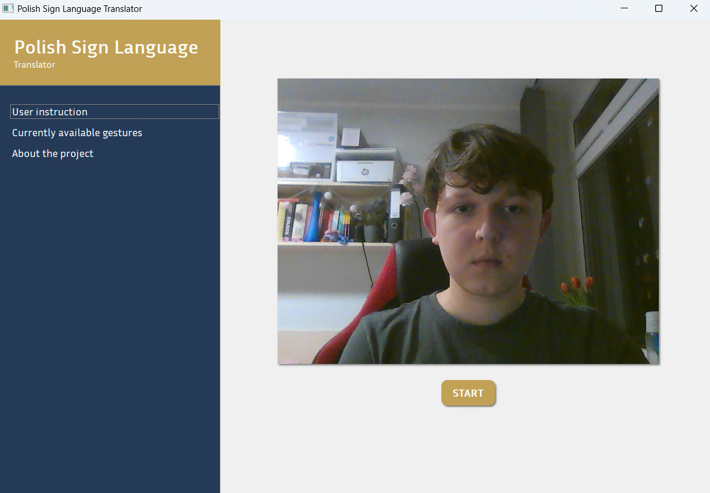

# PSL-Translator

## Overview
**PSL-Translator** is an end-to-end application designed to translate Polish Sign Language (PSL) gestures captured live on camera into fluent Polish text. The system utilizes computer vision to recognize PSL gestures and a Natural Language Processing (NLP) model to refine translations into proper Polish sentences.

## Project Status 🚧
This project is currently under development. While the core functionality is implemented, the trained models required for real-time translation have not yet been published. As a result, users are unable to run the system at this time. The showable version on which the demo was recorded is available at branch **kts**.

## Features
- **Real-time Gesture Recognition**: Captures and processes PSL signs from a webcam.
- **NLP-based Translation**: Converts raw PSL transcripts into fluent Polish text using a, fine-tuned on synthetic dataset, PLT5 transformer model.
  
## Installation
Since the required models are not yet available, the installation instructions will be provided once they are released.

## Demo Video 🎥
[Watch the demo](path/to/demo-video.mp4)

## Temporary UI

## Contributing
We welcome contributions! If you'd like to help, feel free to open an issue or submit a pull request.

## License
This project is licensed under the MIT License.

---
Stay tuned for updates as we progress towards a fully functional PSL-Translator! 🚀
